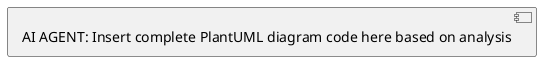
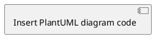

# Generate Visual Diagram Template (PlantUML)

> **Instructions:** This template helps you create comprehensive PlantUML diagrams with accompanying analysis documentation. The AI agent will analyze existing code/flows, generate a diagram with clear syntax for rendering, and create explanatory documentation with recommendations.

---

## 1. Diagram Request Overview

### Diagram Title

<!-- Provide a clear, specific title for this diagram -->

**Title:** [Brief, descriptive title of what you want to diagram]

### Goal Statement

<!-- One paragraph describing what should be documented -->

**Goal:** [Clear statement of what flow/system/architecture you want to visualize and why it would be helpful]

### Diagram Type

<!-- Specify the type of PlantUML diagram to create -->

**Type:** [sequence/activity/class/component/deployment/state/usecase/object/timing]

---

## 2. Code Analysis & Flow Discovery

### Target Components

<!--
AI Agent: Analyze the specified files/systems to understand the flow.
Use codebase_search and read_file tools to gather comprehensive information.
-->

**Files/Systems to Analyze:**

- [File path 1: e.g., `/app/api/example/route.ts`]
- [File path 2: e.g., `/lib/services/example.ts`]
- [Directory: e.g., `/components/chat/`]
- [System: e.g., Authentication flow, Database operations]

### Flow Analysis

<!--
AI Agent: Document your findings from code analysis.
Map out the complete flow including:
- Entry points and triggers
- Decision points and conditionals
- Data transformations
- External service calls
- Error handling paths
- Response/output handling
-->

**Entry Points:**

- [Entry point 1: How the flow starts]
- [Entry point 2: Alternative triggers]

**Key Decision Points:**

- [Decision 1: Condition and outcomes]
- [Decision 2: Validation or routing logic]

**Data Flow:**

- [Step 1: Initial data/request format]
- [Step 2: Transformations and processing]
- [Step 3: External calls or database operations]
- [Step 4: Response format and handling]

**Error Paths:**

- [Error scenario 1: What happens when X fails]
- [Error scenario 2: Validation failures]

**External Dependencies:**

- [Service 1: API calls, database operations]
- [Service 2: Third-party integrations]

---

## 3. Diagram Generation

### Numbering Detection

<!--
AI Agent: Automatically detect the next diagram number.
1. List all files in `.claude/diagrams/`
2. Find files matching pattern `XXX_*.puml` where XXX is a 3-digit number
3. Determine the highest number and increment by 1
4. Format as 3-digit number (e.g., 001, 012, 103)
-->

**Next Diagram Number:** [Auto-detected: e.g., 001, 012, etc.]

### File Naming

<!--
AI Agent: Create standardized file names.
Format: `XXX_descriptive_name.puml`
- XXX = 3-digit auto-incremented number
- descriptive_name = snake_case version of diagram title
-->

**Diagram File:** `.claude/diagrams/[XXX_snake_case_name].puml`
**Analysis File:** `.claude/diagrams/[XXX_snake_case_name]_analysis.md`

### PlantUML Diagram Code

<!--
AI Agent: Generate the complete PlantUML diagram based on your analysis.
Include:
- Proper diagram type syntax (@startuml/@enduml)
- Clear participant/object/component names
- Logical flow connections and messages
- Grouping with boxes or rectangles for components
- Styling with colors and formatting for readability
- Notes explaining complex parts

**CRITICAL SYNTAX RULES TO AVOID ERRORS:**

1. **Use proper PlantUML syntax for diagram type:**
   - Sequence: `participant`, `->`, `-->`, `activate`, `deactivate`
   - Activity: `start`, `stop`, `:action;`, `if/then/else/endif`
   - Class: `class`, `interface`, `abstract`, relationships (`--|>`, `--`, `--*`)
   - Component: `component`, `interface`, `database`, connections (`-->`, `..>`)
   - State: `state`, `[*]`, `-->` for transitions

2. **Quote labels with special characters:**
   - ✅ GOOD: `participant "User Service" as US`
   - ❌ BAD: `participant User-Service as US` (hyphens without quotes)

3. **CRITICAL - Avoid inline colors on nested components:**
   - ❌ BAD: Nested components with inline colors cause parsing errors
   ```plantuml
   package "Frontend" as Frontend {
     component "API Routes" as ApiRoutes #0D47A1 {
       component "/api/example" as ExampleAPI  // ❌ This nesting causes errors
     }
   }
   ```
   - ✅ GOOD: Flatten structure or use containment relationships
   ```plantuml
   package "Frontend" as Frontend {
     component "API Routes" as ApiRoutes
     component "/api/example" as ExampleAPI

     ApiRoutes ..> ExampleAPI  // Use dotted line to show containment
   }
   ```
   - ✅ ALTERNATIVE: Use global skinparam instead of inline colors
   ```plantuml
   skinparam componentBackgroundColor #2196F3

   package "Frontend" {
     component "API Routes"
     component "/api/example"
   }
   ```

4. **Use proper color syntax:**
   - ✅ GOOD: `skinparam sequenceParticipantBackgroundColor #2196F3`
   - ✅ GOOD: Top-level `component "API" #FF9800` (no nesting)
   - ❌ BAD: Inline colors on components nested inside other components/packages

5. **Always close diagram:**
   - Every `@startuml` must have matching `@enduml`

6. **Avoid deep nesting:**
   - PlantUML parsers struggle with components nested >2 levels deep
   - Use containment relationships (`..>`) instead of structural nesting
   - Flatten complex hierarchies into separate logical groupings

**Recommended Styling Pattern:**
```plantuml
@startuml
skinparam backgroundColor #FEFEFE
skinparam defaultFontColor #333333

' Sequence diagrams
skinparam sequenceParticipantBackgroundColor #2196F3
skinparam sequenceParticipantBorderColor #1976D2
skinparam sequenceArrowColor #333333
skinparam sequenceLifeLineBorderColor #888888

' Component/Class diagrams
skinparam componentBackgroundColor #4CAF50
skinparam componentBorderColor #388E3C
skinparam classBackgroundColor #9C27B0
skinparam classBorderColor #7B1FA2

' Activity diagrams
skinparam activityBackgroundColor #FF9800
skinparam activityBorderColor #F57C00
skinparam activityDiamondBackgroundColor #FFC107
skinparam activityDiamondBorderColor #FFA000

@enduml
```
-->



---

## 4. Documentation Generation

### Diagram File Structure

<!--
AI Agent: Create the main diagram file with PlantUML syntax.
The file should be directly renderable by PlantUML tools.
-->

**Main Diagram File Content:**



### Analysis File Structure
<!--
AI Agent: Create separate analysis file with detailed explanations:
1. Flow explanation in plain English
2. Step-by-step walkthrough
3. Decision logic explanation
4. Error handling coverage
5. Recommendations and improvements
-->

**Analysis File Content:**
```markdown
# [Diagram Title] - Flow Analysis

## Overview
[Brief description of what this diagram shows and its purpose]

## Diagram Rendering
To view this diagram:
- **Online**: Copy the .puml content to https://www.plantuml.com/plantuml/uml/
- **Local**: Use PlantUML CLI or IDE plugins (VS Code PlantUML extension)
- **Export**: Generate PNG/SVG using PlantUML tools

## Flow Summary
[Concise explanation of how everything flows through the system]

## Step-by-Step Walkthrough
[Detailed explanation of each major step in the diagram]

## Decision Logic
[Explain key decision points and their criteria]

## Error Handling
[Document error scenarios and how they're handled]

## Key Components
[Explain main components/participants and their roles]

## Recommendations & Ideas
[Bullet points with potential improvements, optimizations, or considerations]

## Related Files
[List relevant source files analyzed for this diagram]
```

---

## 5. Implementation Instructions

### File Creation Steps

<!--
AI Agent: Follow these steps to create the diagram files:
1. Detect next diagram number by listing `.claude/diagrams/` directory
2. Create the main PlantUML diagram file with proper naming (.puml extension)
3. Create the analysis file with `_analysis.md` suffix
4. Ensure both files follow the documented structure
5. Verify PlantUML syntax is valid
6. Test rendering if possible
-->

**Steps to Execute:**

- [ ] Analyze specified code/systems thoroughly
- [ ] Auto-detect next diagram number (XXX format)
- [ ] Generate PlantUML diagram based on analysis
- [ ] Create main diagram file: `.claude/diagrams/XXX_name.puml`
- [ ] Create analysis file: `.claude/diagrams/XXX_name_analysis.md`
- [ ] Validate PlantUML syntax
- [ ] Include rendering instructions in analysis
- [ ] Include comprehensive explanations and recommendations

### Quality Checklist

- [ ] Diagram accurately represents the analyzed flow
- [ ] All major decision points are included
- [ ] Error paths are documented
- [ ] External dependencies are clearly shown
- [ ] **Proper PlantUML syntax** used for chosen diagram type
- [ ] **Color styling applied** for readability and visual hierarchy
- [ ] Analysis explains the flow in simple terms
- [ ] Rendering instructions provided in analysis file
- [ ] Recommendations are actionable and specific
- [ ] File naming follows XXX_name convention
- [ ] Both files are properly formatted and complete
- [ ] **Diagram is renderable without syntax errors**

### PlantUML Syntax Validation Checklist

**MANDATORY - Check before saving:**

- [ ] ✅ No nested components with inline colors (e.g., `component "X" #COLOR { component "Y" }`)
- [ ] ✅ Nesting depth ≤ 2 levels (avoid deeply nested structures)
- [ ] ✅ All containment shown via relationships (`..>`, `-->`) not structural nesting
- [ ] ✅ Every `@startuml` has matching `@enduml`
- [ ] ✅ Special characters in labels are quoted (e.g., `"User-Service"`)
- [ ] ✅ Colors use either global `skinparam` OR inline (not mixed on nested elements)
- [ ] ✅ Test rendering on https://www.plantuml.com/plantuml/uml/ before saving

**Common Parser Errors to Avoid:**

| Error Pattern | Why It Fails | Solution |
|---------------|--------------|----------|
| `component "A" #COLOR { component "B" }` | Nested inline colors | Flatten: both at same level with `A ..> B` |
| `package { component { component } }` | Too deeply nested | Max 2 levels or use relationships |
| `component User-Service` | Unquoted hyphen | Quote: `component "User-Service"` |
| Missing `@enduml` | Incomplete diagram | Always close with `@enduml` |
| Mixed skinparam + inline colors | Parser confusion | Choose one approach consistently |

---

## 6. Template Usage Examples

### Example Request Format

```
"Please generate a sequence diagram showing the authentication flow in our Next.js app.
Analyze /lib/auth.ts, /app/api/auth/*, and /middleware.ts to understand how
users log in, sessions are managed, and protected routes work."
```

### Example Diagram Types by Use Case

- **Sequence (`@startuml` with participants)**: API request flows, user interactions, service communications
- **Activity (`@startuml` with start/stop)**: Business logic flows, algorithms, process workflows
- **Class (`@startuml` with class)**: Data models, object relationships, inheritance structures
- **Component (`@startuml` with component)**: System architecture, module dependencies, microservices
- **State (`@startuml` with state)**: Application states, user states, workflow states
- **Use Case (`@startuml` with usecase)**: User interactions, system features, actor relationships
- **Deployment (`@startuml` with node)**: Infrastructure, server topology, deployment architecture

### PlantUML Syntax Quick Reference

```plantuml
' Sequence Diagram
participant "User" as U
participant "API" as A
U -> A: Request
activate A
A --> U: Response
deactivate A

' Activity Diagram
start
:Initialize;
if (Valid?) then (yes)
  :Process;
else (no)
  :Error;
endif
stop

' Class Diagram
class User {
  +id: string
  +email: string
  +login()
}
class Admin {
  +role: string
}
User <|-- Admin

' Component Diagram
component "Frontend" as FE
component "API" as API
database "Database" as DB
FE --> API
API --> DB

' State Diagram
[*] --> Idle
Idle --> Processing: start
Processing --> Complete: success
Processing --> Error: failure
Complete --> [*]
Error --> [*]
```

---

## 7. Rendering Instructions

### Online Rendering
1. Copy the `.puml` file contents
2. Visit https://www.plantuml.com/plantuml/uml/
3. Paste content and view rendered diagram
4. Export as PNG, SVG, or other formats

### Local Rendering

**VS Code Extension:**
```bash
# Install PlantUML extension
# Open .puml file and use Alt+D to preview
```

**Command Line:**
```bash
# Install PlantUML
brew install plantuml  # macOS
apt-get install plantuml  # Ubuntu/Debian

# Render diagram
plantuml diagram.puml
# Outputs: diagram.png
```

**Python:**
```bash
pip install plantuml
python -m plantuml diagram.puml
```

---

_Template Version: 1.0_
_Last Updated: 2025-12-22_
_Created By: AI Assistant_
_Focus: PlantUML Diagram Generation with Code Analysis_
