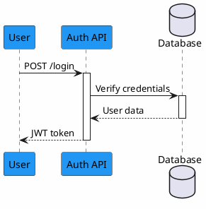

# PlantUML Diagrams Directory

This directory contains PlantUML diagrams generated using the `generate_visual_diagram.md` command template.

## Directory Structure

```
.claude/diagrams/
├── XXX_diagram_name.puml          # PlantUML source file
├── XXX_diagram_name_analysis.md   # Detailed analysis and explanation
└── README.md                      # This file
```

## Naming Convention

- **XXX**: 3-digit auto-incremented number (001, 002, 003, ...)
- **diagram_name**: Snake_case description of the diagram
- **.puml**: PlantUML source file extension
- **_analysis.md**: Companion analysis document

## Rendering Diagrams

### Online (No Installation Required)
1. Copy the contents of any `.puml` file
2. Visit https://www.plantuml.com/plantuml/uml/
3. Paste and view the rendered diagram
4. Export as PNG, SVG, PDF, or other formats

### Local Rendering

#### VS Code Extension
1. Install "PlantUML" extension by jebbs
2. Open any `.puml` file
3. Press `Alt+D` to preview
4. Right-click → Export to save as image

#### Command Line
```bash
# Install PlantUML
brew install plantuml           # macOS
apt-get install plantuml        # Ubuntu/Debian
choco install plantuml          # Windows

# Render single diagram
plantuml diagram_name.puml

# Render all diagrams in directory
plantuml *.puml

# Specify output format
plantuml -tsvg diagram_name.puml
plantuml -tpng diagram_name.puml
```

#### Python
```bash
pip install plantuml

# Render diagram
python -m plantuml diagram_name.puml
```

## Diagram Types Available

- **Sequence**: API flows, user interactions, service communications
- **Activity**: Business logic, algorithms, process workflows
- **Class**: Data models, object relationships, inheritance
- **Component**: System architecture, module dependencies
- **State**: Application states, workflow states
- **Use Case**: User interactions, system features
- **Deployment**: Infrastructure, server topology
- **Object**: Object instances and relationships
- **Timing**: Time-based interactions and constraints

## Creating New Diagrams

Use the command template:
```bash
# Reference the command file
@.claude/commands/generate_visual_diagram.md
```

The AI agent will:
1. Analyze your codebase
2. Auto-detect the next diagram number
3. Generate PlantUML diagram code
4. Create analysis documentation
5. Save files in this directory

## Tips for Better Diagrams

1. **Keep it focused**: One diagram per flow/concept
2. **Use colors**: Apply skinparam styling for visual hierarchy
3. **Add notes**: Explain complex interactions
4. **Group related items**: Use boxes, rectangles, or packages
5. **Document thoroughly**: Always create the companion analysis file

## Example Diagram Structure



## Resources

- **Official Documentation**: https://plantuml.com/
- **Online Editor**: https://www.plantuml.com/plantuml/uml/
- **Syntax Guide**: https://plantuml.com/guide
- **Real World Examples**: https://real-world-plantuml.com/
