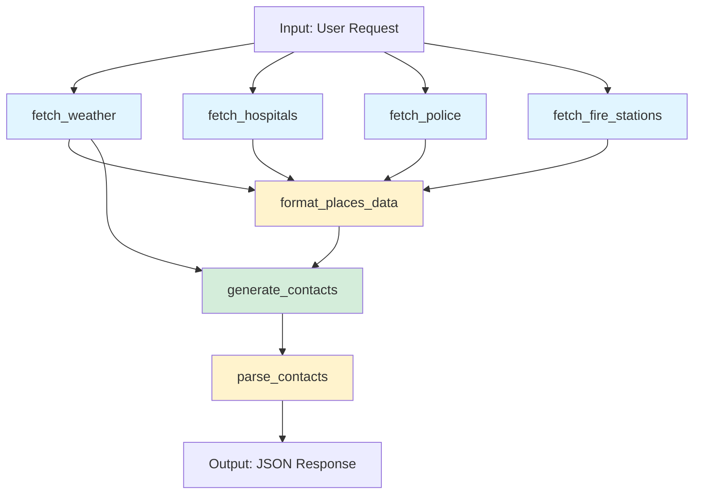

# Emergency Contacts Workflow

**Version:** 2.0.0
**Workflow Name:** `emergency_contacts`
**Model:** Claude 3.5 Sonnet via OpenRouter
**Timeout:** 300 seconds (5 minutes)

## Overview

The Emergency Contacts workflow generates personalized emergency contact recommendations by combining real-time external data (weather, nearby emergency services) with AI-powered analysis. It leverages Google Places API for local service discovery, WeatherAPI for current conditions, and Claude 3.5 Sonnet for intelligent contact curation and meeting location recommendations.

## What It Does

This workflow:
1. **Fetches real-time weather data** for the user's location to inform weather-dependent recommendations
2. **Discovers nearby emergency services** (hospitals, police stations, fire stations) within 8km radius
3. **Formats external data** into a structured template for AI consumption
4. **Generates personalized contact recommendations** using Claude 3.5 Sonnet with context-aware analysis
5. **Parses markdown output to JSON** for structured API responses

The output includes:
- **Emergency Contacts**: Prioritized list with phone numbers, addresses, fit scores, and reasoning
- **Meeting Locations**: 1-3 safe family reunification points based on scenario and proximity
- **Metadata**: Timestamp, API usage stats, and subscription tier information

## Architecture

### Workflow Steps



#### Step 1: `fetch_weather` (External API)
- **Type:** `external_api`
- **Service:** WeatherAPI
- **Operation:** `current`
- **Cache TTL:** 3600 seconds (1 hour)
- **Error Mode:** `continue` (non-blocking)
- **Purpose:** Retrieve current weather conditions to inform scenario-specific recommendations

**API Request:**
```json
{
  "lat": "${input.lat}",
  "lng": "${input.lng}",
  "aqi": false
}
```

#### Step 2-4: `fetch_hospitals`, `fetch_police`, `fetch_fire_stations` (External API)
- **Type:** `external_api`
- **Service:** Google Places API
- **Operation:** `nearby_search`
- **Search Radius:** 8000 meters (8km / ~5 miles)
- **Cache TTL:** 604800 seconds (7 days)
- **Error Mode:** `continue` (non-blocking)
- **Purpose:** Discover local emergency services with contact information and ratings

**API Request Example (Hospitals):**
```json
{
  "location": "${input.lat},${input.lng}",
  "radius": 8000,
  "type": "hospital",
  "keyword": "emergency"
}
```

#### Step 5: `format_places_data` (Transform)
- **Type:** `transform`
- **Operation:** `template`
- **Error Mode:** `continue` (non-blocking)
- **Purpose:** Consolidate Google Places results into a readable format for LLM consumption

**Template:**
```
Hospitals: ${hospitals}
Police Stations: ${police}
Fire Stations: ${fire_stations}
```

**Variables:**
```json
{
  "hospitals": "${steps.fetch_hospitals.data.results}",
  "police": "${steps.fetch_police.data.results}",
  "fire_stations": "${steps.fetch_fire_stations.data.results}"
}
```

#### Step 6: `generate_contacts` (LLM)
- **Type:** `llm`
- **Model:** `anthropic/claude-3.5-sonnet` (via OpenRouter)
- **Prompt Template:** `emergency-contacts/workflow-prompt.md`
- **Temperature:** 0.7
- **Max Tokens:** 4000
- **Error Mode:** `fail` (blocking - workflow fails if LLM call fails)
- **Purpose:** AI-powered analysis and recommendation generation

**Variables Passed to LLM:**
```json
{
  "city": "${input.city}",
  "state": "${input.state}",
  "country": "${input.country}",
  "lat": "${input.lat}",
  "lng": "${input.lng}",
  "scenarios": "${input.scenarios}",
  "family_size": "${input.family_size}",
  "duration": "${input.duration}",
  "user_tier": "${input.user_tier}",
  "static_contacts": "${input.static_contacts}",
  "weather_data": "${steps.fetch_weather.data}",
  "google_places": "${steps.format_places_data.output}"
}
```

#### Step 7: `parse_contacts` (Transform)
- **Type:** `transform`
- **Operation:** `markdown_to_json`
- **Error Mode:** `fail` (blocking - workflow fails if parsing fails)
- **Purpose:** Convert LLM's markdown output into structured JSON for API response

**Input:**
```
${steps.generate_contacts.content}
```

## Input Schema

The workflow expects a JSON object with the following fields:

```typescript
interface EmergencyContactsInput {
  // Location Information (Required)
  city: string;              // City name (e.g., "San Francisco")
  state: string;             // State/province (e.g., "California", "CA")
  country: string;           // Country (e.g., "United States")
  lat: number;               // Latitude (e.g., 37.7749)
  lng: number;               // Longitude (e.g., -122.4194)

  // User Context (Required)
  scenarios: string[];       // Emergency scenarios (e.g., ["earthquake", "wildfire"])
  family_size: number;       // Number of people in household (e.g., 4)
  duration: string;          // Planning timeframe (e.g., "72_hours", "1_week")
  user_tier: string;         // Subscription tier ("BASIC" | "PRO")

  // Static Contact Data (Required)
  static_contacts: string;   // Pre-formatted universal contacts (911, poison control, etc.)
}
```

### Example Input

```json
{
  "city": "San Francisco",
  "state": "California",
  "country": "United States",
  "lat": 37.7749,
  "lng": -122.4194,
  "scenarios": ["earthquake", "wildfire"],
  "family_size": 4,
  "duration": "72_hours",
  "user_tier": "PRO",
  "static_contacts": "### 911 - Emergency Services\n**Phone**: 911\n**Category**: emergency\n**Priority**: critical\n..."
}
```

## Output Schema

The workflow returns a structured JSON object with the following shape:

```typescript
interface EmergencyContactsOutput {
  // Contact Recommendations
  contacts: Array<{
    name: string;              // Contact name (e.g., "UCSF Medical Center")
    phone: string;             // Phone number (e.g., "+1-415-476-1000")
    address?: string;          // Physical address (optional)
    category: string;          // Category (e.g., "medical", "fire", "police", "government")
    priority: "critical" | "important" | "helpful";
    fit_score: number;         // Relevance score (0-100)
    reasoning: string;         // Why this contact is recommended
    hours?: string;            // Operating hours (optional)
    distance?: string;         // Distance from user location (optional)
  }>;

  // Meeting Locations
  meeting_locations: Array<{
    name: string;              // Location name (e.g., "Golden Gate Park - Music Concourse")
    address: string;           // Physical address
    priority: "primary" | "secondary" | "tertiary";
    lat?: number;              // Latitude (optional)
    lng?: number;              // Longitude (optional)
    reasoning: string;         // Why this location is suitable
    distance?: string;         // Distance from user home (optional)
  }>;

  // Metadata
  metadata: {
    generated_at: string;      // ISO 8601 timestamp
    model: string;             // LLM model used
    tokens_used: number;       // Total tokens consumed
    user_tier: string;         // Subscription tier
    scenarios: string[];       // Scenarios analyzed
  };
}
```

### Example Output

```json
{
  "contacts": [
    {
      "name": "911 - Emergency Services",
      "phone": "911",
      "category": "emergency",
      "priority": "critical",
      "fit_score": 100,
      "reasoning": "Universal emergency number for immediate life-threatening situations including earthquake response and wildfire evacuations."
    },
    {
      "name": "UCSF Medical Center",
      "phone": "+1-415-476-1000",
      "address": "505 Parnassus Ave, San Francisco, CA 94143",
      "category": "medical",
      "priority": "critical",
      "fit_score": 95,
      "reasoning": "Level 1 trauma center with earthquake preparedness protocols, 2.3 miles from your location.",
      "hours": "24/7",
      "distance": "2.3 miles"
    }
  ],
  "meeting_locations": [
    {
      "name": "Golden Gate Park - Music Concourse",
      "address": "50 Hagiwara Tea Garden Dr, San Francisco, CA 94118",
      "priority": "primary",
      "lat": 37.7694,
      "lng": -122.4686,
      "reasoning": "Large open space away from buildings, low earthquake risk, 1.8 miles from downtown.",
      "distance": "1.8 miles"
    }
  ],
  "metadata": {
    "generated_at": "2025-12-16T18:30:00Z",
    "model": "anthropic/claude-3.5-sonnet",
    "tokens_used": 2847,
    "user_tier": "PRO",
    "scenarios": ["earthquake", "wildfire"]
  }
}
```

## Error Handling

### Error Modes

The workflow uses two error handling strategies:

1. **`continue` (Non-blocking)**: Steps 1-5 (external APIs and formatting)
   - If an API fails, the workflow continues without that data
   - LLM receives partial data and generates recommendations based on available information
   - Suitable for enhancement data (weather, nearby services)

2. **`fail` (Blocking)**: Steps 6-7 (LLM generation and parsing)
   - If LLM generation fails, the entire workflow fails
   - If JSON parsing fails, the entire workflow fails
   - Critical for core functionality

### Fallback Behavior

- **Weather API failure**: LLM generates contacts without weather context
- **Google Places failure**: LLM relies on static contacts and general knowledge
- **All external APIs fail**: LLM generates recommendations from static contacts + general knowledge
- **LLM generation fails**: Workflow returns error response with failure details
- **JSON parsing fails**: Workflow returns error response indicating malformed LLM output

## Caching Strategy

### Cache TTLs

| Data Source | Cache Duration | Rationale |
|------------|----------------|-----------|
| Weather API | 1 hour (3600s) | Weather changes frequently |
| Google Places | 7 days (604800s) | Emergency service locations are stable |

### Cache Benefits

- **Reduced API costs**: Fewer external API calls
- **Faster response times**: Cached data retrieved instantly
- **Rate limit protection**: Prevents hitting API rate limits
- **Improved reliability**: Serves cached data if API is temporarily unavailable

## Dependencies

### External Services

1. **WeatherAPI** (`app/workflows/external_services.py`)
   - Current weather conditions
   - Requires: `WEATHERAPI_API_KEY` environment variable
   - Rate limit: 1,000,000 calls/month (free tier)

2. **Google Places API** (`app/workflows/external_services.py`)
   - Nearby search for hospitals, police, fire stations
   - Requires: `GOOGLE_SERVICES_API_KEY` environment variable
   - Rate limit: Varies by billing account

3. **OpenRouter API** (`app/workflows/llm_executor.py`)
   - Claude 3.5 Sonnet for AI generation
   - Requires: `OPENROUTER_API_KEY` environment variable
   - Billing: Pay-per-token

### Prompt Templates

Located in `workflows/prompts/emergency-contacts/`:

- **[workflow-prompt.md](prompts/emergency-contacts/workflow-prompt.md)**: Main system prompt with analysis framework
- **[output-format.md](prompts/emergency-contacts/output-format.md)**: Structured output format specification
- **[system-prompt.md](prompts/emergency-contacts/system-prompt.md)**: System-level instructions
- **[scenario-specific/natural-disaster.md](prompts/emergency-contacts/scenario-specific/natural-disaster.md)**: Scenario-specific guidance

### Shared Components

Located in `workflows/prompts/shared/`:

- **[safety-disclaimers.md](prompts/shared/safety-disclaimers.md)**: Legal and safety disclaimers
- **[tone-and-voice.md](prompts/shared/tone-and-voice.md)**: Brand voice guidelines

## Performance Metrics

### Typical Execution Times

- **Step 1 (Weather)**: 200-500ms (1-5ms if cached)
- **Steps 2-4 (Google Places)**: 300-800ms each (1-5ms if cached)
- **Step 5 (Transform)**: <10ms
- **Step 6 (LLM Generation)**: 8-15 seconds (depends on response length)
- **Step 7 (JSON Parsing)**: <50ms
- **Total**: 10-20 seconds (first run), 8-15 seconds (with cache)

### Token Usage

- **Typical input tokens**: 1500-2500 (depends on external data volume)
- **Typical output tokens**: 800-1500 (depends on number of contacts)
- **Average total**: 2500-4000 tokens per execution

## Usage Example

### Python (FastAPI)

```python
from app.workflows.engine import WorkflowEngine

# Initialize workflow engine
engine = WorkflowEngine()

# Prepare input data
workflow_input = {
    "city": "San Francisco",
    "state": "California",
    "country": "United States",
    "lat": 37.7749,
    "lng": -122.4194,
    "scenarios": ["earthquake", "wildfire"],
    "family_size": 4,
    "duration": "72_hours",
    "user_tier": "PRO",
    "static_contacts": "### 911 - Emergency Services\n..."
}

# Execute workflow
result = await engine.execute_workflow(
    workflow_name="emergency_contacts",
    input_data=workflow_input,
    user_id="user_123"
)

# Access results
if result["status"] == "success":
    contacts = result["output"]["contacts"]
    meeting_locations = result["output"]["meeting_locations"]
    metadata = result["output"]["metadata"]
else:
    error = result["error"]
```

### cURL (REST API)

```bash
curl -X POST http://localhost:8000/api/v1/workflows/emergency_contacts/execute \
  -H "Content-Type: application/json" \
  -H "Authorization: Bearer YOUR_API_KEY" \
  -d '{
    "city": "San Francisco",
    "state": "California",
    "country": "United States",
    "lat": 37.7749,
    "lng": -122.4194,
    "scenarios": ["earthquake", "wildfire"],
    "family_size": 4,
    "duration": "72_hours",
    "user_tier": "PRO",
    "static_contacts": "### 911 - Emergency Services\n..."
  }'
```

## Troubleshooting

### Common Issues

**Issue**: Workflow times out
**Solution**: Check external API availability and response times. Consider increasing `timeout_seconds` in workflow definition.

**Issue**: No nearby services found
**Solution**: Increase `radius` in Google Places API configuration or verify location coordinates are correct.

**Issue**: LLM generates invalid JSON
**Solution**: Review prompt templates and ensure output format is clearly specified. Check `output-format.md` template.

**Issue**: High API costs
**Solution**: Verify cache is working properly. Check cache hit rates in logs.

## Version History

### v2.0.0 (Current)
- Multi-source data integration (Weather + Google Places)
- Transform step for data formatting
- Enhanced prompt system with modular templates
- Improved error handling with `continue` mode for external APIs
- 7-day cache for Google Places data

### v1.0.0 (Deprecated)
- Basic LLM generation without external data
- Single-phase prompt system
- No caching
- Removed from codebase

## Related Documentation

- **Prompt System**: See [prompts/README.md](../prompts/README.md) for prompt template documentation
- **API Integration**: See [app/workflows/external_services.py](../app/workflows/external_services.py) for external API implementations
- **Workflow Engine**: See [app/workflows/engine.py](../app/workflows/engine.py) for execution engine documentation
- **Transform Operations**: See [app/workflows/services/transform_executor.py](../app/workflows/services/transform_executor.py) for transform step documentation
