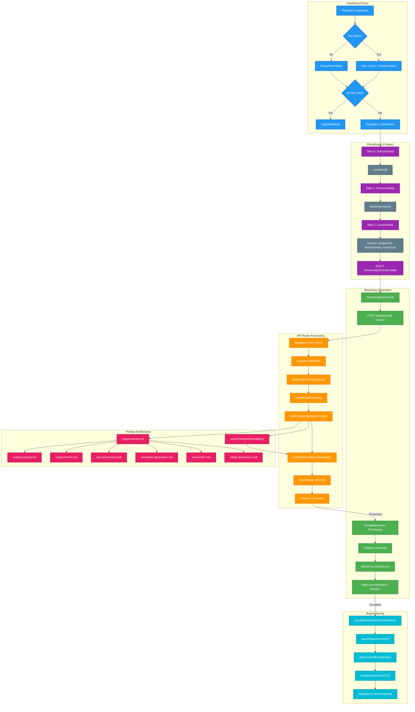

# Plan Creation to Report Generation Flow

## Overview

This diagram documents the complete user flow from clicking "+ Create New Plan" on the dashboard through the 4-step wizard to the streaming LLM report generation and final save. It captures the data flow, LLM integration, prompt construction, and state management.

## Diagram

## Key Components

### 1. Dashboard Entry
- **PlanGrid**: Displays existing plans or empty state
- **EmptyPlansState**: Shows "Create Your First Plan" CTA
- **Plan Limit Check**: Validates subscription tier before allowing creation

### 2. Wizard Steps (PlanWizard.tsx)
| Step | Component | Data Collected |
|------|-----------|----------------|
| 0 | ScenarioStep | `scenarios[]` - Array of disaster types |
| 1 | PersonnelStep | `familyMembers[]` - Age, gender, medical needs |
| 2 | LocationStep | Location, climate zone, budget, duration, home type |
| 3 | StreamingGenerationStep | Triggers generation with all collected data |

### 3. LLM Integration
- **Model**: Claude 3.5 Sonnet via OpenRouter
- **Temperature**: 0.7
- **Streaming**: Real-time response with progress tracking

### 4. Prompt System
- **Modular Templates**: `{{include:}}` pattern for composition
- **Variable Injection**: `{{variable}}` patterns replaced at runtime
- **Scenario-Specific**: Dynamic scenario prompts based on selection

### 5. Report Sections (Output)
1. Executive Summary
2. Risk Assessment
3. Recommended Bundles
4. Survival Skills Needed
5. Day-by-Day Simulation
6. Next Steps

## Related Files

| Category | Files |
|----------|-------|
| Dashboard | `src/components/Dashboard.tsx`, `src/components/dashboard/PlanGrid.tsx` |
| Wizard | `src/components/plans/wizard/PlanWizard.tsx`, `src/components/plans/wizard/steps/*.tsx` |
| Generation | `src/components/planner/StreamingReportView.tsx`, `src/app/api/generate-mission/route.ts` |
| Prompts | `prompts/mission-generation/*.md`, `prompts/mission-generation/scenarios/*.md` |
| Save | `src/app/actions/save-mission-report.ts`, `src/lib/mission-generation/markdown-parser.ts` |
