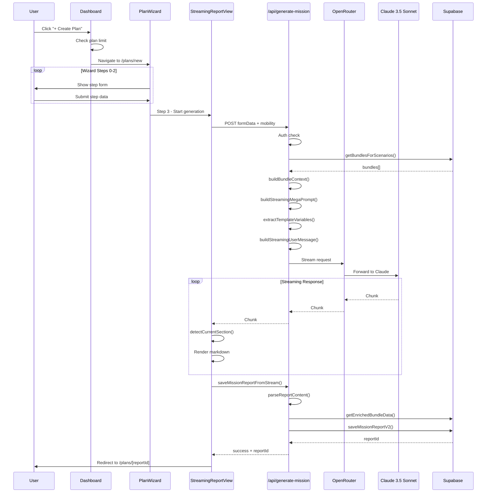

# Plan Creation to Report Generation - Flow Analysis

## Flow Summary

The plan creation flow is a 4-step wizard that collects user information (scenarios, family composition, location context) and then triggers a streaming LLM generation via Claude 3.5 Sonnet. The system uses a modular prompt architecture with template composition, injects user-specific variables, and streams the response in real-time with progress tracking. Upon completion, the report is parsed, enriched with bundle data, and saved to the database.

---

## Step-by-Step Walkthrough

### Phase 1: Dashboard Entry

1. **User clicks "+ Create New Plan"** in either:
   - `EmptyPlansState` component (if no existing plans)
   - Icon button on `PlanGrid` header (if plans exist)

2. **Plan limit check** (`handleCreatePlan()`):
   - Compares current plan count against subscription tier limits
   - If at limit → Shows `UpgradeModal`
   - If under limit → Navigates to `/plans/new`

### Phase 2: Wizard Data Collection

3. **Step 0 - ScenarioStep**: User selects 1+ disaster scenarios
   - Available: natural-disaster, emp-grid-down, pandemic, nuclear, civil-unrest, multi-year-sustainability
   - Validation: At least 1 scenario required

4. **Step 1 - PersonnelStep**: User defines family composition
   - For each member: age, gender, medical conditions, special needs
   - Pre-populates from user profile if available
   - Validation: At least 1 family member required

5. **Step 2 - LocationStep**: User provides context
   - Address via Google Maps autocomplete
   - Auto-detected climate zone
   - Home type selection
   - Duration (3-365 days)
   - Budget tier (LOW=$350, MEDIUM=$1000, HIGH=$2000)
   - Current preparedness level

6. **Step 3 - StreamingGenerationStep**: Triggers generation
   - Aggregates all form data
   - Sets mobility type (currently hardcoded to `BUG_IN`)
   - Memoizes request body to prevent re-renders

### Phase 3: API Route Processing

7. **POST `/api/generate-mission`** receives request

8. **Authentication**: Validates Supabase session

9. **Bundle Selection** (`getBundlesForScenarios()`):
   - Filters bundles by: matching scenario tags, family size requirements, budget (tier × 2 for flexibility)
   - Returns max 10 bundles
   - Fallback: `getAllBundles(10)` if no matches

10. **Bundle Context Building** (`buildBundleContext()`):
    - Formats bundle data for LLM consumption
    - Includes: ID, name, price, items, scenarios

### Phase 4: Prompt Construction (THE KEY PART)

11. **System Prompt Loading** (`buildStreamingMegaPrompt()`):
    ```
    prompts/mission-generation/mega-prompt.md
    ├── {{include:system-prompt.md}}        → Role & expertise
    ├── {{include:output-format.md}}        → Required sections
    ├── {{include:risk-assessment.md}}      → Risk framework
    ├── {{include:simulation-generation.md}} → Day-by-day rules
    ├── {{include:../bundle-recommendations/selection-criteria.md}}
    ├── {{scenario_prompts}}                → Dynamic per scenario
    ├── {{include:../shared/safety-disclaimers.md}}
    └── {{include:../shared/tone-and-voice.md}}
    ```

12. **Variable Extraction** (`extractTemplateVariables()`):
    Replaces `{{variable}}` patterns with computed values:
    | Variable | Source | Example |
    |----------|--------|---------|
    | `{{family_size}}` | `familyMembers.length` | `4` |
    | `{{location}}` | `location.city, state` | `Austin, TX` |
    | `{{climate_zone}}` | Auto-detected | `Hot/Humid` |
    | `{{duration_days}}` | Form input | `14` |
    | `{{budget_amount}}` | Budget tier | `$1000` |
    | `{{water_72hr}}` | `family_size × 3 gallons` | `12 gallons` |
    | `{{food_calories_total}}` | `family_size × 2000 × days` | `112,000 cal` |
    | `{{adults}}` | Count age ≥18 | `2` |
    | `{{children}}` | Count age <18 | `2` |
    | `{{seniors}}` | Count age ≥65 | `0` |
    | `{{medical_summary}}` | Aggregated conditions | `Diabetes, Asthma` |

13. **User Message Construction** (`buildStreamingUserMessage()`):
    ```
    Generate a comprehensive, streaming disaster preparedness mission report.

    **SCENARIOS**: Hurricane, Flood
    **LOCATION**: Austin, TX
    **Climate Zone**: Hot/Humid
    **FAMILY COMPOSITION**:
    - Adults (18-64): 2
    - Children (0-17): 2
    - Seniors (65+): 0
    - Medical conditions: Diabetes (1 member)
    **HOME TYPE**: Single-family House
    **MOBILITY PLAN**: Bug In
    **PLANNING DURATION**: 14 days
    **BUDGET**: Medium ($1000)
    **CURRENT PREPAREDNESS**: Basic

    Follow the exact output format. Only use bundle IDs from the provided list.
    Stream your response progressively.
    ```

### Phase 5: LLM Streaming

14. **OpenRouter API Call**:
    - Model: `anthropic/claude-3.5-sonnet`
    - Temperature: 0.7
    - Streaming enabled

15. **Client-Side Stream Processing** (`StreamingReportView`):
    - Uses `fetch` with `ReadableStream`
    - `AbortController` for cancellation
    - Processes chunks as they arrive

16. **Progress Tracking**:
    - `detectCurrentSection()`: Identifies H2 headers to track which section is generating
    - `getCompletedSections()`: Returns list of finished sections
    - `estimateProgress()`: Calculates 0-100% completion
    - Real-time markdown rendering as content streams

### Phase 6: Report Saving

17. **Stream Completion** triggers `saveMissionReportFromStream()`

18. **Content Parsing** (`parseReportContent()`):
    - Extracts structured sections from markdown
    - Identifies bundle recommendations with IDs
    - Parses survival skills with priorities

19. **Bundle Enrichment** (`getEnrichedBundleData()`):
    - Fetches full bundle data from database
    - Adds: slug, image URL, item count, scenarios

20. **Database Save** (`saveMissionReportV2()`):
    ```typescript
    ReportDataV2 {
      version: '2.0',
      generatedWith: 'streaming_bundles',
      content: string,           // Full markdown
      sections: ParsedSections,  // Structured data
      formData: WizardFormData,  // Original inputs
      metadata: {
        model: 'anthropic/claude-3.5-sonnet',
        streamDurationMs: number,
        generatedAt: ISO timestamp
      }
    }
    ```

21. **Redirect** to `/plans/[reportId]` after 2-second success state

---

## Decision Logic

### Bundle Selection Logic
```
IF scenarios match AND budget ≤ (tier × 2) AND familySize fits:
  → Include bundle
ELSE IF no bundles match:
  → Fallback to getAllBundles(10)
```

### Progress Estimation Logic
```
sections = ['Executive Summary', 'Risk Assessment', 'Recommended Bundles',
            'Survival Skills', 'Day-by-Day Simulation', 'Next Steps']

FOR each section in content:
  IF H2 header found:
    mark section as complete

progress = (completedSections / totalSections) × 100
```

### Prompt Template Resolution
```
1. Load mega-prompt.md
2. FOR each {{include:path}} pattern:
     Replace with file contents at path
3. FOR each {{scenario_prompts}} placeholder:
     FOR each selected scenario:
       Append scenario-specific prompt
4. FOR each {{variable}} pattern:
     Replace with computed value from formData
```

---

## Error Handling

| Error Type | Handler | User Action |
|------------|---------|-------------|
| Auth failure (401) | Show error state | Return to dashboard |
| Validation error | Show error state | Return to wizard step |
| Stream timeout | AbortController | Retry button |
| Parse failure | Graceful degradation | Save raw content |
| DB save failure | Show error state | Retry button |

---

## Recommendations & Ideas

### Performance Optimizations
- **Prompt Caching**: Cache compiled mega-prompts by scenario combination (could reduce prompt build time by ~200ms)
- **Bundle Pre-fetch**: Start bundle selection during Step 2 while user fills location
- **Streaming Chunk Size**: Tune chunk size for optimal UX (current: default)

### User Experience Improvements
- **Resume Generation**: If user navigates away, allow resuming from last streamed position
- **Section Preview**: Show skeleton of expected sections before streaming starts
- **Estimated Time**: Display "~2-3 minutes" based on historical generation times

### Technical Debt
- **Mobility Hardcode**: `BUG_IN` is hardcoded - should be selectable in wizard
- **Error Granularity**: Bundle-specific errors not distinguished from general failures
- **Prompt Versioning**: No version tracking for prompt templates

### Security Considerations
- **Rate Limiting**: Consider per-user rate limits on generation endpoint
- **Content Validation**: Validate LLM output before saving (check for required sections)
- **Bundle ID Validation**: Verify bundle IDs in LLM response exist in database

### Future Enhancements
- **Multi-Model Support**: Allow selection of different LLM providers
- **Prompt A/B Testing**: Track prompt versions and measure output quality
- **Partial Regeneration**: Allow regenerating individual sections
- **Export Options**: PDF/print-friendly version of report

---

## Token Usage Estimates

| Component | Estimated Tokens |
|-----------|-----------------|
| System Prompt (mega-prompt compiled) | ~3,000-4,000 |
| Bundle Context (10 bundles) | ~1,500-2,000 |
| User Message | ~300-500 |
| **Total Input** | ~5,000-6,500 |
| Output (full report) | ~4,000-6,000 |
| **Total per Generation** | ~9,000-12,500 |

---

## Mermaid Sequence Diagram (Alternative View)


