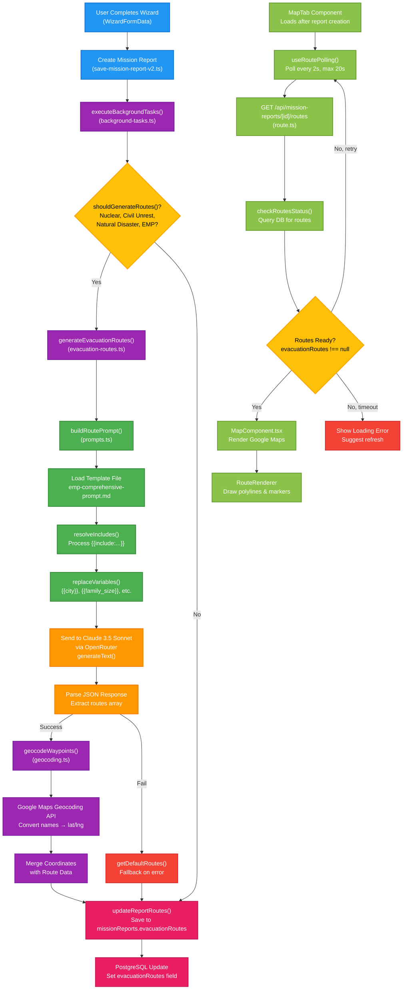

# Map & Route Generation Flow

## Overview

This diagram shows the complete end-to-end flow of evacuation route generation in the Emergency Planner app, including background processing, prompt assembly, LLM interaction, geocoding, database persistence, and frontend polling/display.

## Diagram

## Key Components

### 1. Background Task Orchestration
- **File**: [src/lib/mission-generation/background-tasks.ts](../../src/lib/mission-generation/background-tasks.ts)
- **Function**: `executeBackgroundTasks()`
- Triggered after mission report creation
- Determines if scenarios require evacuation routes
- Manages 20-second timeout for generation

### 2. Prompt Assembly System
- **File**: [src/lib/prompts.ts](../../src/lib/prompts.ts)
- **Function**: `buildRoutePrompt()`
- **Template**: [prompts/evacuation-routes/emp-comprehensive-prompt.md](../../prompts/evacuation-routes/emp-comprehensive-prompt.md)
- Loads template, resolves `{{include:...}}` directives
- Replaces variables: `{{city}}`, `{{state}}`, `{{family_size}}`, `{{scenarios}}`, etc.

### 3. LLM Route Generation
- **File**: [src/lib/mission-generation/evacuation-routes.ts](../../src/lib/mission-generation/evacuation-routes.ts)
- **Function**: `generateEvacuationRoutes()`
- Uses OpenRouter to call Claude 3.5 Sonnet
- Temperature: 0.7
- Expects JSON response with routes array

### 4. Geocoding Service
- **File**: [src/lib/geocoding.ts](../../src/lib/geocoding.ts)
- **Function**: `geocodeWaypoints()`
- Converts waypoint names to lat/lng coordinates
- Uses Google Maps Geocoding API
- Filters out failed geocodes, preserves successful ones

### 5. Frontend Polling System
- **File**: [src/hooks/useRoutePolling.ts](../../src/hooks/useRoutePolling.ts)
- Polls every 2 seconds for up to 20 seconds (10 attempts)
- Checks `/api/mission-reports/[id]/routes` endpoint
- Returns loading state, routes, and errors

### 6. Map Display
- **File**: [src/components/plans/map/MapComponent.tsx](../../src/components/plans/map/MapComponent.tsx)
- Renders Google Maps with dark tactical theme
- Displays routes as polylines with distinct colors
- Shows waypoint markers with navigation details

## Related Files

- [src/lib/mission-generation/background-tasks.ts](../../src/lib/mission-generation/background-tasks.ts) - Background task orchestration
- [src/lib/mission-generation/evacuation-routes.ts](../../src/lib/mission-generation/evacuation-routes.ts) - Route generation logic
- [src/lib/prompts.ts](../../src/lib/prompts.ts) - Prompt assembly utilities
- [src/lib/geocoding.ts](../../src/lib/geocoding.ts) - Google Maps geocoding integration
- [src/hooks/useRoutePolling.ts](../../src/hooks/useRoutePolling.ts) - Frontend polling hook
- [src/app/api/mission-reports/[id]/routes/route.ts](../../src/app/api/mission-reports/[id]/routes/route.ts) - API endpoint
- [src/components/plans/map/MapComponent.tsx](../../src/components/plans/map/MapComponent.tsx) - Map rendering
- [prompts/evacuation-routes/emp-comprehensive-prompt.md](../../prompts/evacuation-routes/emp-comprehensive-prompt.md) - Route prompt template
- [src/db/schema/mission-reports.ts](../../src/db/schema/mission-reports.ts) - Database schema
