# Google Places Cache Examples - When Cache Hits vs Misses

## Overview

Visual examples demonstrating **exact parameter matching** behavior in the Google Places cache. This shows why the cache is NOT semantic and requires byte-for-byte parameter identity.

## Cache Hit Examples (Will Use Cached Data)


## Cache Miss Examples (Will Call Google API)

```mermaid
flowchart LR
    subgraph Example3["Example 3: Different Radius Values"]
        R3A["Request 1<br/>params = {<br/>  'location': '40.7,-74.0',<br/>  'radius': 5000<br/>}"] --> K3A["Cache Key:<br/>aaa111..."]
        R3B["Request 2<br/>params = {<br/>  'location': '40.7,-74.0',<br/>  'radius': 10000<br/>}"] --> K3B["Cache Key:<br/>bbb222..."]
        K3A --> Miss3A["❌ CACHE MISS<br/>Different hash"]
        K3B --> Miss3B["❌ CACHE MISS<br/>Makes API call"]
    end

    subgraph Example4["Example 4: Nearby Locations"]
        R4A["Request 1<br/>NYC City Hall<br/>location = '40.7128,-74.0060'"] --> K4A["Cache Key:<br/>ccc333..."]
        R4B["Request 2<br/>100m away<br/>location = '40.7138,-74.0060'"] --> K4B["Cache Key:<br/>ddd444..."]
        K4A --> Miss4A["❌ CACHE MISS<br/>Different coordinates"]
        K4B --> Miss4B["❌ CACHE MISS<br/>Geographic proximity<br/>doesn't matter!"]
    end

    subgraph Example5["Example 5: Semantically Similar Queries"]
        R5A["Request 1<br/>query = 'hospitals in NYC'"] --> K5A["Cache Key:<br/>eee555..."]
        R5B["Request 2<br/>query = 'hospitals in New York City'"] --> K5B["Cache Key:<br/>fff666..."]
        R5C["Request 3<br/>query = 'NYC hospitals'"] --> K5C["Cache Key:<br/>ggg777..."]
        K5A --> Miss5A["❌ CACHE MISS"]
        K5B --> Miss5B["❌ CACHE MISS<br/>No semantic matching!"]
        K5C --> Miss5C["❌ CACHE MISS<br/>Each query = new API call"]
    end

    %% Styling
    classDef cacheMiss fill:#E91E63,stroke:#C2185B,stroke-width:2px,color:#fff
    classDef request fill:#2196F3,stroke:#1976D2,stroke-width:2px,color:#fff
    classDef key fill:#9C27B0,stroke:#7B1FA2,stroke-width:2px,color:#fff

    class Miss3A,Miss3B,Miss4A,Miss4B,Miss5A,Miss5B,Miss5C cacheMiss
    class R3A,R3B,R4A,R4B,R5A,R5B,R5C request
    class K3A,K3B,K4A,K4B,K5A,K5B,K5C key
```



## Detailed Examples Table

| Request 1 | Request 2 | Cache Result | Reason |
|-----------|-----------|--------------|---------|
| `{"location": "40.7,-74.0", "radius": 5000}` | `{"radius": 5000, "location": "40.7,-74.0"}` | ✅ **HIT** | Parameter order doesn't matter (sorted before hashing) |
| `{"query": "hospitals in NYC"}` | `{"query": "hospitals in NYC"}` | ✅ **HIT** | Exact duplicate (within 7 days) |
| `{"location": "40.7,-74.0", "radius": 5000}` | `{"location": "40.7,-74.0", "radius": 10000}` | ❌ **MISS** | Different radius value |
| `{"location": "40.7128,-74.0060"}` | `{"location": "40.7129,-74.0060"}` | ❌ **MISS** | Different coordinates (even 100m apart) |
| `{"location": "40.7128,-74.0060"}` | `{"location": "40.71,-74.00"}` | ❌ **MISS** | Different precision (40.7128 ≠ 40.71) |
| `{"query": "hospitals in NYC"}` | `{"query": "hospitals in New York City"}` | ❌ **MISS** | Different query text (no normalization) |
| `{"query": "hospitals in NYC"}` | `{"query": "Hospitals in NYC"}` | ❌ **MISS** | Case sensitivity (different strings) |
| `{"query": "hospitals in NYC"}` | `{"query": "hospitals in nyc"}` | ❌ **MISS** | Case matters! |
| `{"location": "40.7,-74.0", "type": "hospital"}` | `{"location": "40.7,-74.0", "type": "pharmacy"}` | ❌ **MISS** | Different place type |

## Geographic Proximity Test Cases

### Scenario: Multiple Requests Near NYC City Hall

```
Request 1: location = "40.7128,-74.0060" (City Hall exact)
Request 2: location = "40.7138,-74.0060" (100m north)
Request 3: location = "40.7128,-74.0070" (75m west)
Request 4: location = "40.7129,-74.0061" (10m northeast)
```

**Result**: All 4 requests generate DIFFERENT cache keys and make SEPARATE API calls

**Why**: SHA-256 hash is cryptographically sensitive to any byte change. Even 0.0001° difference (~11m) creates completely different hash.

**Impact**:
- 4 API calls (even though all are within ~100m radius)
- 4 separate database entries
- Each costs $0.017 (Places Nearby Search)
- Total cost: $0.068 (vs $0.017 with semantic cache)

## Semantic Similarity Examples (All Cache Misses)

These queries are semantically **identical** but generate **different cache keys**:

```
1. "hospitals in New York"
2. "hospitals in New York City"
3. "hospitals in NYC"
4. "NYC hospitals"
5. "New York hospitals"
6. "hospitals near New York"
7. "New York area hospitals"
```

**Result**: 7 separate API calls (7 × $0.032 = $0.224)

**With semantic normalization**: 1 API call ($0.032) - saves $0.192

## Expiration Examples

### Example 1: Cache Expiration After 7 Days
```
Day 0 (Monday):
  Request 1 → API call → Cache stored (expires Day 7)

Day 3 (Thursday):
  Request 2 (same params) → ✅ Cache hit (not expired)

Day 8 (Monday):
  Request 3 (same params) → ❌ Cache miss (expired)
  → Makes new API call
  → Cache stored (expires Day 15)
```

### Example 2: Cache Hit Count Tracking
```
Initial Request (cache miss):
  hit_count = 0, last_accessed_at = NULL

1st Cache Hit:
  hit_count = 1, last_accessed_at = 2025-01-01 10:00:00

2nd Cache Hit:
  hit_count = 2, last_accessed_at = 2025-01-01 14:30:00

10th Cache Hit:
  hit_count = 10, last_accessed_at = 2025-01-05 09:15:00
```

**High hit_count entries** = most valuable cached data (cost savings)

## Real-World Impact Analysis

### Scenario: Emergency Planning App for NYC

**User Behavior**:
- 100 users search for "hospitals near me"
- Each user has slightly different GPS coordinates (10-50m apart)
- All within 5-minute window

**Current Cache Behavior**:
- 100 different location coordinates
- 100 different cache keys
- 100 API calls to Google Places
- **Cost**: 100 × $0.017 = **$1.70**

**With Semantic Cache (100m radius)**:
- Fuzzy match finds cached result within 100m
- 1 API call (first user)
- 99 cache hits from fuzzy matching
- **Cost**: 1 × $0.017 = **$0.017**
- **Savings**: $1.683 (99% reduction)

**Recommendation**: Implement geographic clustering with PostGIS for location-based queries.

## Cache Key Generation Code Example

```python
import hashlib
import json

# Example 1: Same params, different order
params1 = {"radius": 5000, "location": "40.7,-74.0", "type": "hospital"}
params2 = {"location": "40.7,-74.0", "type": "hospital", "radius": 5000}

# Normalize (sort keys)
normalized1 = json.dumps(params1, sort_keys=True, separators=(',', ':'))
normalized2 = json.dumps(params2, sort_keys=True, separators=(',', ':'))

print(normalized1)
# Output: {"location":"40.7,-74.0","radius":5000,"type":"hospital"}

print(normalized2)
# Output: {"location":"40.7,-74.0","radius":5000,"type":"hospital"}
# ✅ Identical! (order doesn't matter)

# Generate hash
composite1 = f"google_places|nearby_search|{normalized1}"
hash1 = hashlib.sha256(composite1.encode()).hexdigest()[:64]

composite2 = f"google_places|nearby_search|{normalized2}"
hash2 = hashlib.sha256(composite2.encode()).hexdigest()[:64]

print(hash1 == hash2)  # True ✅


# Example 2: Slight difference in location
params3 = {"location": "40.7,-74.0", "radius": 5000}
params4 = {"location": "40.7001,-74.0", "radius": 5000}

normalized3 = json.dumps(params3, sort_keys=True, separators=(',', ':'))
normalized4 = json.dumps(params4, sort_keys=True, separators=(',', ':'))

hash3 = hashlib.sha256(f"google_places|nearby_search|{normalized3}".encode()).hexdigest()[:64]
hash4 = hashlib.sha256(f"google_places|nearby_search|{normalized4}".encode()).hexdigest()[:64]

print(hash3 == hash4)  # False ❌ (tiny coordinate difference = completely different hash)
```

## Summary

### ✅ Cache WILL Hit For:
1. **Exact parameter matches** (including sorted keys)
2. **Same parameters in different order**
3. **Requests within 7-day TTL**

### ❌ Cache WILL MISS For:
1. **Any parameter value change** (even 0.0001° in coordinates)
2. **Different query text** (even semantically identical)
3. **Case differences** in text queries
4. **Nearby locations** (geographic proximity doesn't matter)
5. **Expired entries** (older than 7 days)

### 🎯 Key Insight:
**The cache is optimized for EXACT duplicate elimination, not semantic similarity.**

To improve cache hit rates for similar (but not identical) requests, consider implementing:
1. Query normalization (lowercase, abbreviation expansion)
2. Geographic clustering (PostGIS spatial indexing)
3. Adaptive rounding for coordinates (e.g., round to 4 decimal places = ~11m precision)
