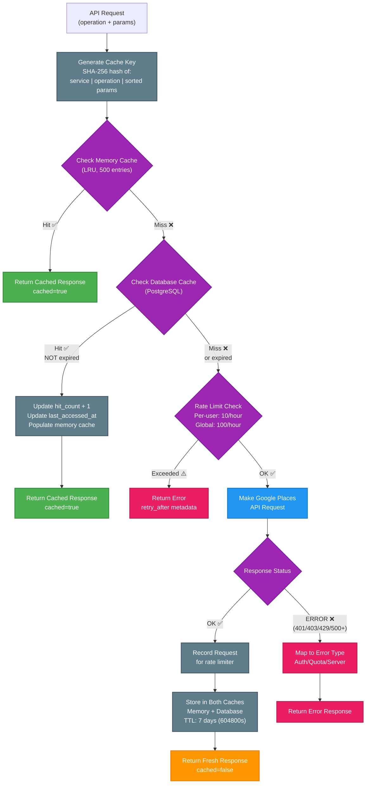

# Google Places 7-Day Cache Flow

## Overview

This diagram illustrates the two-level caching system for Google Places API requests in the LLM_service. The cache uses **exact parameter matching** (not semantic) via SHA-256 hash keys, with a 7-day default TTL for both memory and database persistence.

## Diagram



## Key Components

### Cache Key Generation
- **Algorithm**: `SHA-256(service_name | operation | JSON.stringify(params, sort_keys=true))`
- **Example**: `google_places|nearby_search|{"location":"40.7,-74.0","radius":5000}` → `a1b2c3d4e5f6...` (64 chars)
- **Critical**: Parameters are sorted alphabetically before hashing to ensure consistent keys

### Two-Level Cache Architecture
1. **Level 1 - Memory Cache (LRU)**
   - 500-entry OrderedDict with thread-safe locking
   - Evicts least recently used entries when full
   - Sub-millisecond access time
   - Volatile (cleared on service restart)

2. **Level 2 - Database Cache (PostgreSQL)**
   - Persistent storage via `external_api_cache` table
   - 7-day default TTL (configurable per request)
   - Tracks hit_count and last_accessed_at for analytics
   - Automatic expiration via `expires_at` timestamp

### Google Places Operations Supported
- `nearby_search`: Find places within radius of lat/lng
- `text_search`: Search places by text query
- `place_details`: Get detailed info for specific place_id

## Related Files

- **Cache Manager**: `LLM_service/app/workflows/cache_manager.py:1-330`
- **Google Places Service**: `LLM_service/app/workflows/services/google_places.py:1-388`
- **External Services Base**: `LLM_service/app/workflows/external_services.py:1-305`
- **Database Model**: `LLM_service/app/models/external_api_cache.py:1-50`
- **Migration**: `LLM_service/migrations/002_create_external_api_cache.sql:1-38`
- **Tests**: `LLM_service/tests/test_cache_manager.py:1-276`

## Cache Behavior Examples

### ✅ **WILL Use Cache** (Exact Match)
```python
# First request (cache miss)
params1 = {"location": "40.7128,-74.0060", "radius": 5000, "type": "hospital"}
# Cache key: abc123... (stored for 7 days)

# Second request within 7 days (cache hit)
params2 = {"radius": 5000, "location": "40.7128,-74.0060", "type": "hospital"}
# Cache key: abc123... (same key due to sorted params)
# Returns cached response immediately
```

### ❌ **Will NOT Use Cache** (Different Parameters)
```python
# Request 1
params1 = {"location": "40.7128,-74.0060", "radius": 5000}
# Cache key: abc123...

# Request 2 - Different radius
params2 = {"location": "40.7128,-74.0060", "radius": 10000}
# Cache key: def456... (different key!)
# Makes new API call

# Request 3 - Different location
params3 = {"location": "40.7129,-74.0060", "radius": 5000}
# Cache key: ghi789... (different key!)
# Makes new API call
```

### ⚠️ **Geographic Proximity Does NOT Matter**
```python
# New York City Hall
params1 = {"location": "40.7128,-74.0060", "radius": 5000}
# Cache key: aaa111...

# 100 meters away (still different cache entry)
params2 = {"location": "40.7138,-74.0060", "radius": 5000}
# Cache key: bbb222... (completely different!)
# Makes new API call even though locations are very close
```

### 🔍 **Text Queries Are NOT Semantically Matched**
```python
# Query 1
params1 = {"query": "hospitals in New York"}
# Cache key: xxx111...

# Query 2 - Semantically similar but different text
params2 = {"query": "hospitals in New York City"}
# Cache key: yyy222... (different!)
# Makes new API call

# Query 3 - Typo or variation
params3 = {"query": "hospital in New York"}
# Cache key: zzz333... (different!)
# Makes new API call
```

## Cache Invalidation

- **Time-Based**: Entries expire after 7 days (604800 seconds)
- **Manual Cleanup**: Background job calls `cache_manager.clear_expired()`
- **No Semantic Invalidation**: Nearby locations or similar queries don't invalidate each other
- **Parameter Changes**: Any parameter change generates new cache key (instant invalidation)
