# System Architecture Blueprint

## App Summary

**End Goal:** Build complete disaster readiness plans (from 72-hour survival to multi-year sustainability) within minutes using AI that generates location-specific survival strategies with calculated supply quantities, barter-economy trade goods, critical skill gaps, and budget-optimized product recommendations.

**Template Foundation:** RAG-SaaS (Next.js + Supabase + AI)

**Deployment Platform:** Render.com

**Required Extensions:** Subscription system, inventory tracking, skills library, expert calls, email automation, analytics

---

## 🏗️ System Architecture

### Template Foundation

**Your Chosen Template:** Custom RAG-SaaS Implementation

**Built-in Capabilities:**
- Next.js 14+ with App Router (Server Components, Server Actions, API Routes)
- Supabase Authentication (email/password, OAuth ready)
- PostgreSQL Database with pgvector (semantic search capabilities)
- Gemini AI Integration (mission report generation - to be migrated to Vercel AI SDK)
- Amazon Product API via Decodo (✅ already implemented)
- Tailwind CSS styling framework
- TypeScript type safety

**Current Deployment:**
- Hosted on Render.com
- Supabase for database and auth (external managed service)
- Environment variable configuration

---

### Architecture Diagram

```mermaid
graph TB
    subgraph "User Interface Layer"
        WebApp[Next.js Web Application<br/>React Server Components]
        AdminPanel[Admin Dashboard<br/>Bundle Management]
    end

    subgraph "Application Layer - Template Foundation"
        Auth[Supabase Auth<br/>Email/OAuth]
        Middleware[Next.js Middleware<br/>Auth & Tier Gating]
        ServerActions[Server Actions<br/>Form Submissions]
        APIRoutes[API Routes<br/>Webhooks & Crons]
    end

    subgraph "Application Layer - Extensions"
        PromptSystem[Centralized Prompt System<br/>Markdown Files in /prompts]
        AIAbstraction[Vercel AI SDK<br/>LLM Abstraction Layer]
        EmailService[Email Automation<br/>Resend + React Email]
        SubscriptionMgmt[Subscription Management<br/>Stripe Webhooks]
        BundleEngine[Bundle Recommendation Engine<br/>AI-Powered Matching]
        InventoryTracker[Inventory Tracking System<br/>Owned vs Needed]
        CallScheduler[Expert Call Scheduler<br/>Zoom Integration]
    end

    subgraph "Data Layer - Template Foundation"
        ProductCatalog[(Product Catalog<br/>categories, master_items,<br/>specific_products)]
        BundleSystem[(Bundle System<br/>bundles, bundle_items)]
        MissionReports[(Mission Reports<br/>AI-Generated Plans)]
        CommerceData[(Commerce Tables<br/>orders, shipments)]
    end

    subgraph "Data Layer - Extensions"
        Subscriptions[(Subscription Data<br/>profiles.subscription_tier)]
        Inventory[(Inventory Tracking<br/>inventory_items)]
        Skills[(Skills Resources<br/>skills_resources)]
        Calls[(Expert Calls<br/>expert_calls, attendance)]
        Analytics[(Analytics & Logs<br/>activity_log, billing)]
    end

    subgraph "Storage Layer"
        SupabaseStorage[Supabase Storage<br/>Images, Documents]
    end

    subgraph "External Services"
        Gemini[Google Gemini 2.0 Flash<br/>via Vercel AI SDK]
        Decodo[Decodo Web Scraping API<br/>Amazon Search & Product]
        Stripe[Stripe API<br/>Subscription Payments]
        Resend[Resend API<br/>Email Delivery]
        ZoomAPI[Zoom API<br/>Meeting Management]
    end

    subgraph "Background Processing"
        CronJobs[Render.com Cron Jobs<br/>Scheduled Tasks]
        EmailQueue[Email Automation Queue<br/>Newsletter, Drips, Alerts]
    end

    %% User flows
    WebApp --> Auth
    AdminPanel --> Auth
    WebApp --> Middleware
    AdminPanel --> Middleware
    
    %% Application layer connections
    Middleware --> ServerActions
    Middleware --> APIRoutes
    ServerActions --> PromptSystem
    ServerActions --> AIAbstraction
    APIRoutes --> SubscriptionMgmt
    APIRoutes --> EmailService
    
    %% AI workflow
    PromptSystem --> AIAbstraction
    AIAbstraction --> Gemini
    AIAbstraction --> BundleEngine
    BundleEngine --> BundleSystem
    
    %% Data connections
    ServerActions --> ProductCatalog
    ServerActions --> BundleSystem
    ServerActions --> MissionReports
    ServerActions --> Inventory
    ServerActions --> Skills
    ServerActions --> Calls
    
    %% Extension connections
    SubscriptionMgmt --> Stripe
    SubscriptionMgmt --> Subscriptions
    EmailService --> Resend
    EmailService --> PromptSystem
    CallScheduler --> ZoomAPI
    CallScheduler --> Calls
    InventoryTracker --> Inventory
    
    %% Amazon integration
    AdminPanel --> Decodo
    Decodo --> ProductCatalog
    
    %% Background processing
    CronJobs --> EmailQueue
    EmailQueue --> EmailService
    CronJobs --> APIRoutes
    
    %% Analytics
    ServerActions --> Analytics
    WebApp --> Analytics
    
    %% Storage
    WebApp --> SupabaseStorage
    AdminPanel --> SupabaseStorage

    %% Styling
    classDef userInterface fill:#1E88E5,stroke:#1565C0,stroke-width:2px,color:#fff
    classDef frontend fill:#42A5F5,stroke:#1976D2,stroke-width:2px,color:#fff
    classDef backend fill:#66BB6A,stroke:#388E3C,stroke-width:2px,color:#fff
    classDef database fill:#4CAF50,stroke:#2E7D32,stroke-width:2px,color:#fff
    classDef cache fill:#81C784,stroke:#43A047,stroke-width:2px,color:#fff
    classDef aiServices fill:#AB47BC,stroke:#7B1FA2,stroke-width:2px,color:#fff
    classDef external fill:#FF7043,stroke:#D84315,stroke-width:2px,color:#fff
    classDef payment fill:#FFA726,stroke:#F57C00,stroke-width:2px,color:#fff
    classDef storage fill:#26A69A,stroke:#00695C,stroke-width:2px,color:#fff
    classDef queue fill:#EC407A,stroke:#C2185B,stroke-width:2px,color:#fff

    class WebApp,AdminPanel userInterface
    class Auth,Middleware,ServerActions,APIRoutes frontend
    class PromptSystem,AIAbstraction,EmailService,SubscriptionMgmt,BundleEngine,InventoryTracker,CallScheduler backend
    class ProductCatalog,BundleSystem,MissionReports,CommerceData,Subscriptions,Inventory,Skills,Calls,Analytics database
    class SupabaseStorage storage
    class Gemini,Decodo aiServices
    class Stripe payment
    class Resend,ZoomAPI external
    class CronJobs,EmailQueue queue
```



---

### Extension Strategy

**Why These Extensions:** Your template provides excellent infrastructure (auth, database, AI integration, product catalog) but needs targeted additions for the specific preparedness marketplace features.

**Integration Points:**
- **Vercel AI SDK** - Abstracts all LLM calls (mission generation, bundle matching, email personalization)
- **Centralized Prompts** - All AI prompts stored in `/prompts` folder as markdown files
- **Resend Email** - React Email templates with AI-generated personalized content
- **Stripe Subscriptions** - Three tiers (Free/Basic/Pro) with webhook-driven tier management
- **Decodo API** - Already integrated for Amazon product enrichment (✅ working)

**Avoided Complexity:**
- ❌ No Redis caching (PostgreSQL sufficient for current scale)
- ❌ No message queues (Render.com cron jobs handle background tasks)
- ❌ No microservices (monolithic Next.js app appropriate for Phase 1)
- ❌ No separate API server (Server Actions and API Routes sufficient)
- ❌ No complex deployment orchestration (Render.com handles everything)

---

### System Flow Explanation

**Template Foundation Flow:**

1. **User Authentication** - Supabase Auth handles signup/login, creates session
2. **Product Catalog** - Already has 3-tier hierarchy (categories → master_items → specific_products)
3. **Amazon Integration** - Decodo API enriches products from ASIN or search (✅ working)
4. **Mission Reports** - Gemini generates survival plans (to be migrated to Vercel AI SDK)
5. **Bundle System** - Database schema exists, needs AI matching algorithm

**Extension Integration:**

1. **Subscription Flow:**
   - User visits pricing page → Stripe Checkout → Webhook updates `profiles.subscription_tier`
   - Middleware checks tier on every request → Gates features by tier
   - Billing history auto-populated from Stripe webhooks

2. **AI-Powered Features:**
   - All prompts loaded from `/prompts/*.md` files
   - Vercel AI SDK routes requests to Gemini (switchable to other providers)
   - Bundle recommendations: Load prompt → AI filters/ranks bundles → Return top matches
   - Email personalization: Load prompt → AI generates content per user → Resend sends

3. **Inventory & Readiness:**
   - User marks bundles as purchased → Creates `inventory_items` entries
   - Readiness score calculated: (owned items / needed items) * weights
   - Gap analysis: AI identifies critical missing items → Recommendations

4. **Expert Calls:**
   - Admin schedules calls → Creates `expert_calls` record
   - Users register → Creates `call_attendance` record (enforces max attendees)
   - Cron job sends reminders 24h and 30min before call
   - Zoom API generates meeting links

5. **Email Automation:**
   - Cron jobs trigger at scheduled times
   - Fetch opted-in users by segment
   - AI generates personalized content per user (using prompts)
   - React Email renders template
   - Resend delivers emails in batches

**Data Flow:**

```
User Action
    ↓
Next.js Server Action
    ↓
Load Prompt from /prompts/*.md
    ↓
Vercel AI SDK → Gemini API
    ↓
Process Response + Update Database
    ↓
Return to User Interface
    ↓
(Optional) Log Activity → user_activity_log
```

---

## ⚠️ Technical Risk Assessment

### ✅ Template Foundation Strengths (Low Risk)

**What Your Template Already Handles Well:**
- ✅ **User Authentication** - Supabase Auth is battle-tested, handles OAuth, sessions, security
- ✅ **Database Management** - PostgreSQL with excellent schema design (95% ready for launch)
- ✅ **Product Catalog** - 3-tier hierarchy with vector embeddings for semantic search
- ✅ **Amazon Integration** - Decodo API already working for product enrichment
- ✅ **AI Pipeline** - Gemini integration functional, just needs migration to Vercel AI SDK
- ✅ **Scalability** - Render.com auto-scales, Supabase handles 100K+ users easily

### ⚠️ Extension Integration Points (Monitor These)

**1. Prompt Management System**
- **Risk:** File system reads on every AI call could be slow
- **System-Level Approach:** Implement prompt caching layer - load prompts once at startup, cache in memory
  ```typescript
  // lib/prompts/cache.ts
  const promptCache = new Map<string, string>();
  
  export async function getCachedPrompt(path: string): Promise<string> {
    if (!promptCache.has(path)) {
      promptCache.set(path, await loadPrompt(path));
    }
    return promptCache.get(path)!;
  }
  ```

**2. Vercel AI SDK Migration**
- **Risk:** Existing Gemini calls may have different response formats than Vercel AI SDK
- **Mitigation Strategy:** Incremental migration approach
  - Phase 1: New features use Vercel AI SDK
  - Phase 2: Migrate mission generation one prompt at a time
  - Phase 3: Test thoroughly, comparing outputs before/after
- **Benefit:** Switching models becomes trivial if Gemini has issues

**3. Stripe Webhook Reliability**
- **Risk:** Webhook failures could leave users with wrong subscription tier
- **System-Level Approach:** Idempotent webhook handlers with retry logic
  ```typescript
  // Track processed events in database
  await db.insert(processedWebhooks).values({ stripeEventId });
  
  // Handle webhook idempotently
  if (alreadyProcessed) return; // Skip duplicates
  ```
- **Backup:** Daily cron job syncs Stripe subscription status to catch any missed webhooks

**4. Email Deliverability (Resend)**
- **Risk:** Emails going to spam reduces engagement
- **Mitigation Strategy:** 
  - Warm up sending domain gradually (start with 100/day, increase slowly)
  - Implement SPF, DKIM, DMARC records properly
  - Monitor bounce rates and unsubscribe rates
  - Use Resend's reputation monitoring
- **Fallback:** If deliverability drops, can switch to AWS SES or SendGrid easily (React Email templates portable)

**5. AI Cost Management**
- **Risk:** AI calls expensive at scale (Gemini Flash ~$0.075/1M input tokens)
- **System-Level Approach:**
  - Cache AI responses for identical inputs (bundle recommendations per scenario combination)
  - Use Gemini Flash for most calls (cheap), reserve Pro for complex tasks only
  - Implement token usage tracking per request
  ```typescript
  // Track AI costs per feature
  await db.insert(aiUsageLog).values({
    feature: 'bundle_recommendation',
    model: 'gemini-2.0-flash',
    inputTokens: 1200,
    outputTokens: 800,
    estimatedCost: 0.0015
  });
  ```

**6. Render.com Cron Job Reliability**
- **Risk:** Cron jobs might fail silently (email reminders not sent)
- **Mitigation Strategy:**
  - Implement health check endpoints that verify last cron run
  - Send admin alerts if cron jobs haven't run in expected window
  - Add retry logic for failed email sends
  - Store cron job execution history in database

### 🟢 Smart Architecture Decisions

**Your Extension Strategy Reduces Risk:**

✅ **Template-First Development** - Leveraging existing Supabase Auth instead of building custom auth  
✅ **Proven Service Providers** - Stripe (payments), Resend (email), Decodo (scraping) are all reliable  
✅ **Centralized Prompts** - Easy to update, version controlled, non-technical team can edit  
✅ **Vercel AI SDK Abstraction** - Switch models without code changes if Gemini has issues  
✅ **Monolithic Architecture** - Simpler to debug, deploy, and maintain than microservices  
✅ **Render.com Deployment** - Auto-scaling, managed infrastructure, less ops overhead than self-hosted

---

## 🏗️ Implementation Strategy

### Phase 1 (Leverage Template Foundation + Critical Extensions)

**Week 1-2: Database & Subscription System**
1. Add subscription columns to `profiles` table (tier, Stripe customer ID)
2. Create 6 new tables: `inventory_items`, `skills_resources`, `expert_calls`, `call_attendance`, `user_activity_log`, `billing_transactions`
3. Enhance `order_items` and `external_transactions` with bundle tracking
4. Implement Stripe webhook handlers
5. Add middleware for tier-based feature gating

**Week 3-4: Prompt System & AI Migration**
1. Create `/prompts` folder structure with markdown files
2. Implement prompt loader with caching
3. Migrate mission generation to Vercel AI SDK
4. Build bundle recommendation engine with AI matching
5. Implement readiness score calculation

**Week 5-6: Email & Calls**
1. Set up Resend account and domain authentication
2. Create React Email templates
3. Implement AI-powered email personalization
4. Build expert call scheduling system
5. Set up Render.com cron jobs for automation

**Week 7-8: Inventory & Analytics**
1. Build inventory tracking UI
2. Implement readiness dashboard
3. Add user activity logging
4. Create admin analytics views
5. Test bundle performance tracking

### Phase 2 (Add Required Extensions - Months 3-4)

**Growth Features:**
1. Multi-location planning (Pro tier)
2. Offline PWA capabilities
3. Bundle expiration tracking
4. Vendor portal for Phase 2 dropship
5. Influencer marketplace
6. Habit tracker & gamification

### Integration Guidelines

**How to Connect Extensions to Template Without Breaking Existing Functionality:**

1. **Database Migrations via Drizzle:**
   ```bash
   # Generate migration for new tables
   npm run db:generate
   
   # Review migration SQL before applying
   cat src/db/migrations/0001_add_extensions.sql
   
   # Apply to Supabase
   npm run db:migrate
   ```

2. **Preserve Existing APIs:**
   - Don't modify existing Server Actions
   - Create new Server Actions for extensions
   - Use middleware to add tier gating without changing routes

3. **Incremental Feature Rollout:**
   - Deploy subscription system first (doesn't affect existing users)
   - Add inventory tracking second (optional feature)
   - Skills and calls are net-new, no conflicts
   - Email automation runs independently

4. **Testing Strategy:**
   - Test new tables in isolation
   - Test Stripe webhooks in test mode before production
   - Test AI SDK migration with side-by-side output comparison
   - Test email templates locally with React Email dev server

---

## 🛠️ Development Approach

### Template-First Development

**Maximize Use of Existing Template Features Before Adding Complexity:**

✅ **Already Built (Use As-Is):**
- Supabase Auth for all authentication flows
- Product catalog schema (categories, master_items, specific_products)
- Bundle schema (bundles, bundle_items)
- Mission reports storage
- Amazon integration via Decodo
- Admin product management workflows

✅ **Enhance Existing (Minimal Changes):**
- Add subscription columns to `profiles`
- Add bundle tracking to `order_items` and `external_transactions`
- Migrate AI calls to Vercel AI SDK (same functionality, better abstraction)

➕ **Add New (Required for Features):**
- Inventory tracking (new user need)
- Skills resources (new content type)
- Expert calls (new engagement channel)
- Email automation (new communication channel)
- Analytics (new admin capability)

### Minimal Viable Extensions

**Add Services Only When Template Capabilities Aren't Sufficient:**

| Feature Need | Template Capability | Extension Required |
|--------------|-------------------|-------------------|
| User Auth | ✅ Supabase Auth | None |
| Database | ✅ PostgreSQL | Add 6 tables |
| AI Generation | ✅ Gemini API | Migrate to Vercel AI SDK |
| Product Catalog | ✅ Full schema | None |
| Amazon Products | ✅ Decodo API | None |
| Subscriptions | ❌ Not included | Add Stripe |
| Inventory | ❌ Not included | Add tracking tables |
| Skills Library | ❌ Not included | Add resource cache |
| Expert Calls | ❌ Not included | Add scheduling system |
| Email | ❌ Not included | Add Resend |
| Analytics | ❌ Not included | Add activity logging |

### Extension Integration Patterns

**Proven Patterns for Safely Extending Your Chosen Template:**

1. **Additive Database Changes:**
   - Never drop existing tables
   - Add new columns with defaults (non-breaking)
   - Create new tables for new features
   - Use foreign keys to link to existing tables

2. **Middleware for Feature Gating:**
   ```typescript
   // middleware.ts
   export async function middleware(req: NextRequest) {
     const user = await getUser(req);
     
     // Check tier for protected routes
     if (req.nextUrl.pathname.startsWith('/inventory')) {
       if (user.tier === 'FREE' && /* trying to access history */) {
         return NextResponse.redirect('/pricing');
       }
     }
     
     return NextResponse.next();
   }
   ```

3. **Server Actions for Business Logic:**
   - Keep all database operations in Server Actions
   - Use Drizzle ORM for type-safe queries
   - Return serializable data to client
   - Handle errors gracefully

4. **API Routes for Webhooks Only:**
   - Stripe webhooks → `/api/webhooks/stripe`
   - Resend webhooks → `/api/webhooks/resend`
   - Cron jobs → `/api/cron/*`
   - Everything else uses Server Actions

---

## 🎯 Success Metrics

This system architecture supports your core value proposition: **"Build complete disaster readiness plans in minutes with AI-powered survival strategies and curated bundles"**

**Template Optimization:**
- Leverages Supabase Auth (battle-tested authentication)
- Leverages PostgreSQL with pgvector (semantic search built-in)
- Leverages existing product catalog (3-tier hierarchy with embeddings)
- Leverages Decodo API (Amazon product enrichment already working)

**Focused Extensions:**
- Adds Stripe for subscriptions (required for freemium business model)
- Adds Vercel AI SDK for flexible AI provider management
- Adds Resend for email automation (required for engagement)
- Adds inventory tracking (required for readiness scoring)
- Adds skills library (required for training resources)
- Adds expert calls (required for Pro tier value prop)
- Adds analytics (required for admin insights and optimization)

**Reduced Complexity:**
- Avoids premature caching infrastructure (PostgreSQL sufficient)
- Avoids message queue complexity (cron jobs sufficient)
- Avoids microservices overhead (monolith appropriate)
- Avoids custom auth implementation (Supabase proven)
- Avoids building product scraper (Decodo API working)

**Scalability Path:**
- Current architecture supports 10K-50K users without changes
- Can add Redis caching when needed (if response times slow)
- Can add read replicas when needed (if database bottleneck)
- Can optimize Gemini usage with caching (if AI costs too high)
- Can partition logs by month when needed (if analytics slow)

---

## 📊 Technology Stack Summary

### **Frontend**
- **Next.js 14+** - React framework with App Router
- **React Server Components** - Server-side rendering
- **Tailwind CSS** - Utility-first styling
- **TypeScript** - Type safety

### **Backend**
- **Next.js Server Actions** - Form submissions and mutations
- **Next.js API Routes** - Webhooks and cron jobs
- **Drizzle ORM** - Type-safe database queries
- **Vercel AI SDK** - LLM abstraction layer

### **Database & Auth**
- **Supabase PostgreSQL** - Relational database
- **pgvector** - Vector embeddings for semantic search
- **Supabase Auth** - User authentication and sessions

### **AI & Data Services**
- **Google Gemini 2.0 Flash** - AI text generation (via Vercel AI SDK)
- **Decodo Web Scraping API** - Amazon product enrichment (✅ working)

### **External Services**
- **Stripe** - Subscription billing and payments
- **Resend** - Email delivery with React Email templates
- **Zoom API** - Expert call meeting management

### **Deployment & Infrastructure**
- **Render.com** - Web service hosting with auto-scaling
- **Render.com Cron Jobs** - Background task scheduling
- **Supabase Hosting** - Managed database and auth

### **Development Tools**
- **Drizzle Kit** - Database migrations
- **React Email** - Email template development
- **TypeScript** - Type checking
- **ESLint** - Code linting

---

## 🚀 Deployment Architecture

### **Render.com Configuration**

**Web Service:**
- **Type:** Node.js (Next.js)
- **Build Command:** `npm install && npm run build`
- **Start Command:** `npm start`
- **Auto-Deploy:** Push to main branch
- **Environment:** Node.js 20+

**Environment Variables:**
```
# Database
DATABASE_URL=postgresql://...
DIRECT_URL=postgresql://...

# Supabase
NEXT_PUBLIC_SUPABASE_URL=https://...
NEXT_PUBLIC_SUPABASE_ANON_KEY=...
SUPABASE_SERVICE_ROLE_KEY=...

# AI
GOOGLE_GENERATIVE_AI_API_KEY=...

# Amazon Scraping
DECODO_API_KEY=...

# Payments
STRIPE_SECRET_KEY=sk_live_...
STRIPE_WEBHOOK_SECRET=whsec_...
NEXT_PUBLIC_STRIPE_PUBLISHABLE_KEY=pk_live_...

# Email
RESEND_API_KEY=re_...
RESEND_FROM_EMAIL=noreply@emergencyplanner.com

# Zoom
ZOOM_API_KEY=...
ZOOM_API_SECRET=...

# Security
CRON_SECRET=... (auto-generated)
```

**Cron Jobs:**
```yaml
# Weekly Newsletter - Every Monday at 10 AM
/api/cron/send-weekly-newsletter
Schedule: 0 10 * * 1

# Call Reminders - Daily at 9 AM
/api/cron/send-call-reminders  
Schedule: 0 9 * * *

# Expiration Alerts - Daily at 8 AM
/api/cron/send-expiration-alerts
Schedule: 0 8 * * *

# Sync Stripe Subscriptions - Daily at 2 AM
/api/cron/sync-stripe-subscriptions
Schedule: 0 2 * * *
```

---

## 📁 Prompt System Structure

### **Centralized Prompt Management**

```
/prompts/
├── README.md                           # Guidelines and conventions
│
├── mission-generation/
│   ├── system-prompt.md                # Core mission context
│   ├── scenarios/
│   │   ├── natural-disaster.md
│   │   ├── emp-grid-down.md
│   │   ├── pandemic.md
│   │   ├── nuclear.md
│   │   ├── civil-unrest.md
│   │   └── multi-year-sustainability.md
│   ├── supply-calculation.md
│   ├── evacuation-routing.md
│   └── simulation-log-generation.md
│
├── bundle-recommendations/
│   ├── system-prompt.md
│   ├── scenario-matching.md
│   ├── family-size-optimization.md
│   ├── budget-tier-filtering.md
│   └── customization-suggestions.md
│
├── readiness-assessment/
│   ├── system-prompt.md
│   ├── scoring-algorithm.md
│   ├── gap-analysis.md
│   └── improvement-recommendations.md
│
├── skills-resources/
│   ├── system-prompt.md
│   ├── resource-curation.md
│   ├── difficulty-assessment.md
│   └── prerequisite-identification.md
│
├── email-personalization/
│   ├── system-prompt.md
│   ├── newsletter-generation.md
│   ├── scenario-drip-campaigns.md
│   ├── bundle-recommendations.md
│   └── upgrade-prompts.md
│
├── admin-analytics/
│   ├── user-insights.md
│   ├── bundle-performance-analysis.md
│   ├── product-enrichment.md
│   └── content-recommendations.md
│
└── shared/
    ├── tone-and-voice.md
    ├── safety-disclaimers.md
    └── technical-terminology.md
```

**Naming Convention:**
- Folders: `kebab-case` for feature areas
- Files: `kebab-case.md` with descriptive names
- System prompts: Always `system-prompt.md` in each folder
- Specific tasks: Named after purpose (`gap-analysis.md`)

**Benefits:**
- 📝 Non-technical team can edit prompts
- 🔍 Git tracks all prompt version history
- 🧪 Easy A/B testing with prompt variants
- 🎯 Consistent voice across all AI interactions
- 🚀 Update prompts without code deployment

---

> **Next Steps:** 
> 1. Enhance database schema (6 new tables + 3 table enhancements)
> 2. Set up centralized prompt system
> 3. Migrate AI calls to Vercel AI SDK
> 4. Integrate Stripe subscriptions
> 5. Implement Resend email automation
> 6. Build inventory tracking system
> 7. Add expert call scheduling
> 8. Deploy to Render.com with cron jobs

**Your architecture leverages an excellent template foundation and adds only the extensions you actually need. Time to build!** 🎯

